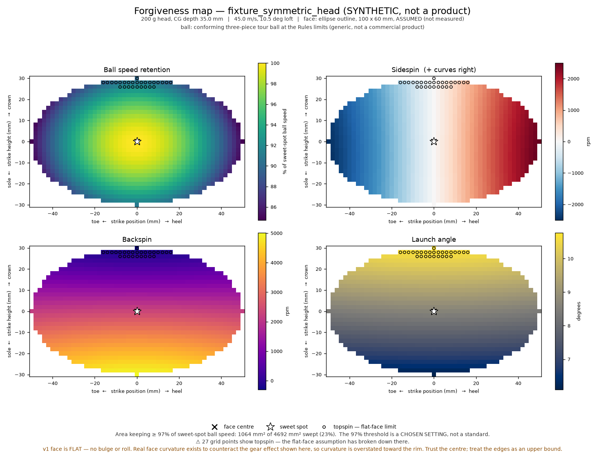

# GolfLab

An engineering platform for golf club design, analysis, and R&D — built to support real club fitting and performance calculations, not a consumer app or chatbot.

## Overview

GolfLab models golf clubs as structured engineering data and provides validated calculations used in real club design:

- **Swing weight** — measures how a club's mass is distributed relative to a 14-inch fulcrum point, expressed on the industry-standard Lorythmic scale (e.g. D2).
- **Moment of Inertia (MOI)** — measures a club's resistance to rotation, a key factor in how "forgiving" or head-heavy a club feels through impact.
- **Center of gravity / club diagram** — computes the club's overall balance point along its length and renders a 1D positional diagram of the grip, shaft, head, and balance point.
- **Clubhead weight distribution** — models a clubhead as several discrete weight ports (e.g. toe, heel, back) at 2D positions within the head, computes the head's own local center of gravity, and renders a 2D diagram — similar in spirit to perimeter-weighting / movable-weight-system design.
- **Ball flight prediction** — combines a club specification and a player's swing profile (clubhead speed, attack angle, swing path, face angle, dynamic loft) into launch conditions and a numerically simulated trajectory (carry distance, peak height, lateral deviation, shot shape).
- **Prototype comparison** — compares two saved clubs side by side, showing not just their individual results but the calculated delta between them, so a designer can see exactly what effect a design change had.
- **Impact model and forgiveness map** — a rigid-body impulse–momentum model of the ball–face collision. Given a clubhead's mass, centre of gravity and full inertia tensor (as exported from CAD) and a strike location, it predicts ball speed, launch angle, backspin and sidespin from first principles; sweeping the strike across the face produces a forgiveness map, with a two-head difference map for design comparison.

Club specifications are validated on creation against 25 specific club types (driver, 3/5/7 wood, 2/3/4 hybrid, 2-9 iron, and wedges by loft in 2-degree increments from 46° to 64°), each with its own length and loft range, and can be saved and reloaded, so prototypes persist across sessions rather than existing only for a single run.

## Features

- Typed, validated club specification model covering 25 specific club types, each with its own length and loft range (driver, 3/5/7 wood, 2/3/4 hybrid, 2-9 iron, wedges by loft 46°-64°)
- Swing weight calculation with Lorythmic scale conversion
- Moment of Inertia calculation
- Center of gravity calculation with 1D matplotlib diagram
- Clubhead weight-distribution modeling with 2D matplotlib diagram
- Ball flight prediction: launch conditions and a drag/lift-simulated trajectory
- JSON-based persistence (save/load club prototypes by name)
- Prototype comparison with calculated deltas
- Impact model: effective mass, gear effect, and stick/slip friction from a clubhead's inertia tensor — every constant sourced to the R&A/USGA Equipment Rules or the literature, with page numbers
- Forgiveness maps (ball speed retention, sidespin, backspin, launch angle) as matplotlib figures from the CLI and as an interactive canvas in the web app, plus a B − A comparison map
- Command-line interface with input validation and error handling
- FastAPI backend exposing every calculation and persistence operation as an HTTP endpoint
- Full pytest test coverage, including isolated tests for file-based persistence

## Getting started

```bash
git clone https://github.com/finleytaylor18/golflab.git
cd golflab
python3 -m venv venv
source venv/bin/activate
pip install -r requirements.txt
python3 cli.py
```

## Running the web app

The web app is a React frontend (`frontend/`) served directly by the FastAPI
backend as static files, so there's a single process and a single port —
no separate frontend server to keep running alongside the API.

```bash
cd frontend && npm install && npm run build && cd ..
uvicorn main:app --reload --port 8000
```

Open `http://localhost:8000` for the app, or `http://localhost:8000/docs`
for interactive API documentation (Swagger UI) — every endpoint can also be
tried directly from the browser without the frontend.

If you're actively editing frontend code and want hot-reload instead of
re-running `npm run build` after every change, run the Vite dev server
alongside the API instead:

```bash
# terminal 1
uvicorn main:app --reload --port 8000
# terminal 2
cd frontend && npm run dev
```

`vite.config.ts` proxies `/calculations`, `/clubs` and `/heads` to the API, so the
frontend code always uses relative URLs and doesn't need to know or care
which of the two setups above is serving it.

## Impact model and forgiveness map

The impact model treats the clubhead as a free rigid body for the few hundred
microseconds of contact and solves the collision with an impulse–momentum
formulation. Two ideas do most of the work:

- **Effective mass.** Off-centre, the head rotates as well as translates, so the
  ball feels a lighter club: `1/M_eff = 1/M + b²/I`. That single expression is
  the mathematical definition of forgiveness, and the map is a picture of it.
- **Gear effect.** Because the centre of gravity sits behind the face, that
  rotation drags the face across the ball and gears spin onto it — draw spin
  from a toe strike, fade spin from a heel strike, less backspin high on the
  face. It scales with strike offset and CG depth and inversely with MOI.



*The figure is of `fixture_symmetric_head`, a synthetic head used for tests —
not a real product. Every map states its head, ball, swing conditions, and
whether the face outline was measured or assumed.*

Run it from the CLI (`python3 cli.py`, options 6 and 7) or from the web app's
"Impact model & forgiveness map" panel, where the map is interactive: hover a
strike to read every launch condition at that point, click to pin it, drag the
retention threshold and watch the forgiving area recompute, and compare two
heads. Head mass properties are entered in the units Fusion 360 reports them
in (g, mm, g·cm²); the physics core is SI throughout.

The physics, sources, assumptions, validity range and validation results are in
[`docs/impact_model.md`](docs/impact_model.md). Two of the validation checks are
exact reproductions of published equations (Penner 2003 eq. 6, and the R&A/USGA
COR protocol's own formula); the rest are honest comparisons, including the ones
that do not agree. The largest known limitation is that the v1 face is flat:
real bulge and roll exist to counteract the gear effect the model computes, so
curvature is overstated toward the rim of the face.

## Running tests

```bash
pytest
```

## Engineering assumptions and known limitations

This is a v1 model, and its assumptions are documented deliberately rather than hidden:

- **Shaft mass** is modeled as a point mass at the shaft's midpoint, assuming uniform mass distribution. Real shafts taper, so this is an approximation.
- **Clubhead position** is modeled at the full club length from the butt end, without accounting for the head's actual center of gravity inset. This tends to make swing weight estimates run somewhat higher than a physically measured club.
- **Grip center of mass** is assumed to sit 5 inches from the butt end for all clubs.
- Swing weight conversion constants (A0 reference point, points-per-increment) were calibrated against publicly available reference examples, not an official manufacturer specification.
- **Mass validation ranges** (`MIN_MASS`/`MAX_MASS`) are global across all club types; length and loft ranges are type-specific but mass ranges are not yet.
- **Wedge length** doesn't vary by loft — every wedge (46°-64°) validates against the same length range, since real wedge length is much more a matter of player/fitter preference than a reliable function of loft the way iron length is. Iron and wood/hybrid length *does* vary by number, since that relationship is well-established in real graduated sets.
- **Clubhead weight ports** are modeled independently of `ClubSpecification` — a weight-port composition is not persisted alongside a saved club, and its individual port masses are not currently checked against the club's overall `head_mass`.
- **Ball flight aerodynamic constants** (drag coefficient, lift-coefficient-vs-spin-ratio slope, smash factor curve, spin rate model) are simplified, physically-motivated approximations, not manufacturer or peer-reviewed aerodynamic data — see the comments in `ball_flight.py` for what each constant represents and how it was calibrated.
- **Impact model** assumptions — flat rigid face, single COR and friction coefficient, uniform-sphere ball inertia — are listed with their consequences and a validity range in [`docs/impact_model.md`](docs/impact_model.md) §3–4.
- **`SwingProfile.dynamic_loft`** is an independent input (the loft actually presented to the ball at impact), not derived from the club's static `loft` — this lets a player's shaft-lean/delofting be modeled without assuming a fixed relationship between the two.

These are documented, intentional simplifications for a first version — refining them with real calibration data (from actual measured clubs) is a planned future improvement.

## Tech stack

- Python 3
- pytest
- numpy
- matplotlib
- FastAPI / uvicorn
- React / TypeScript / Vite
- Recharts for trajectory charting

## Roadmap

- [x] Swing weight calculator
- [x] Moment of Inertia calculator
- [x] Persistence (save/load club specifications)
- [x] Prototype comparison
- [x] Center of gravity visualization
- [x] Club type customization with type-specific validation, split into 25 specific clubs (numbered irons/woods/hybrids, wedges by loft)
- [x] Clubhead weight-distribution modeling
- [x] Ball flight prediction
- [x] FastAPI backend
- [x] React frontend with live-recalculating club/swing panels
- [x] Ball flight simulation panel with shot-shape charting
- [x] Impact model v1: effective mass, gear effect, stick/slip friction, validated against published results
- [x] Forgiveness map (CLI figures and interactive web panel) with two-head comparison
- [ ] Impact model v2: bulge and roll, face flexibility
- [ ] Materials database